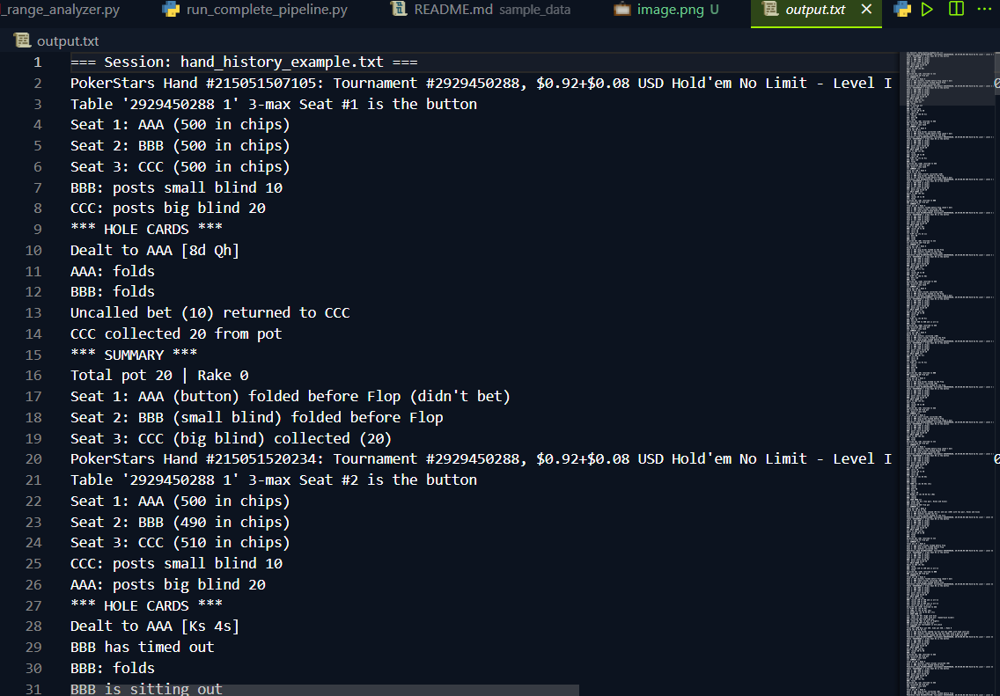
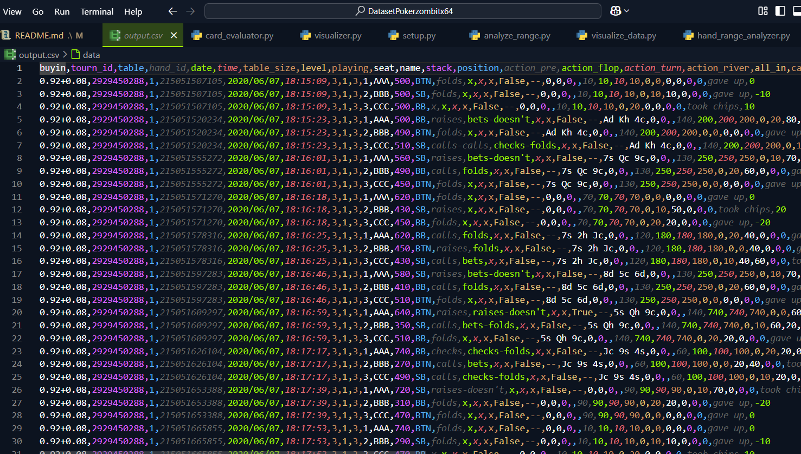

# Pokerzombitx64 Dataset

## Overview
The Pokerzombitx64 dataset is a comprehensive collection of poker game data designed for analysis, machine learning, and strategy development. This repository contains structured poker hand histories, player statistics, and annotated game situations.

## Dataset Structure
```
DatasetPokerzombitx64/
├── raw_data/       # Unprocessed poker hand histories
├── processed_data/ # Cleaned and formatted data ready for analysis
├── metadata/       # Information about the dataset collection process
├── examples/       # Example usage and analysis scripts
└── docs/           # Additional documentation and explanations
```

## Data Format
Each poker hand is stored in a structured format that includes:
- Hand ID and timestamp
- Game type, stakes, and table information
- Player positions and stack sizes
- Complete action sequence (bets, raises, calls, folds)
- Showdown results when applicable

### Data Source
The dataset is primarily compiled from `output.txt` files that contain poker hand histories. These text files are processed and converted into structured formats (CSV, JSON) for easier analysis. The original `output.txt` files are preserved in the raw_data directory.

## Usage
This dataset can be used for:
- Developing poker strategy algorithms
- Training machine learning models for decision making
- Analyzing player tendencies and game patterns
- Simulating poker scenarios and outcomes

### Sample Data Table

| Hand ID | Player | Position | Stack | Action | Street | Amount | Pot Size |
|---------|--------|----------|-------|--------|--------|--------|----------|
| H001    | Player1| BTN     | $100  | Raise  | Preflop| $3.5   | $5.0     |
| H001    | Player2| SB      | $97   | Call   | Preflop| $2.5   | $5.0     |
| H001    | Player1| BTN     | $96.5 | Check  | Flop   | $0     | $5.0     |
| H001    | Player2| SB      | $94.5 | Bet    | Flop   | $3.5   | $8.5     |
| H001    | Player1| BTN     | $96.5 | Fold   | Flop   | $0     | $8.5     |
| H002    | Player3| CO      | $120  | Raise  | Preflop| $4.0   | $6.0     |
| H002    | Player1| BTN     | $96.5 | Call   | Preflop| $4.0   | $10.0    |






## Getting Started
```python
# Example code to load and analyze the dataset
import pandas as pd

# Load hand history data
hands = pd.read_csv('processed_data/hands.csv')

# Basic statistics
print(f"Total hands: {len(hands)}")
print(f"Average pot size: ${hands['pot_size'].mean():.2f}")
```

## Contributing
Contributions to expand and improve the dataset are welcome! Please follow these steps:
1. Fork the repository
2. Create a feature branch
3. Submit a pull request with a clear description of your changes

## License
This dataset is available under [specify license type] - see LICENSE file for details.

## Contact
For questions or feedback about this dataset, please contact [your contact information].

## Acknowledgements
Special thanks to [mention any contributors or data sources if applicable].
